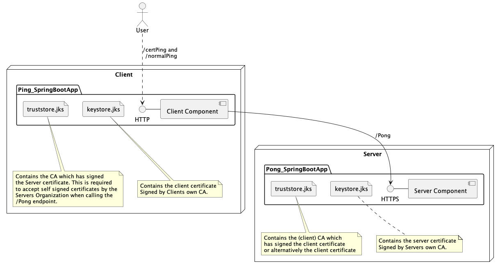

# Welcome to a round of mTLS Ping-Pong

This is just a small blueprint to demonstrate the configuration  of a **zero trust** approach for SpringBoot components.
What you will find here, is the following setup:

## Usage to play with the Sample

First you need to create a fresh set of required certificates, which does this script for you:
[create_and_distribute_sample_certificates.sh](Certificate_Factory%2Fcreate_and_distribute_sample_certificates.sh)

To execute it you require _openssl_ to be available on your machine. Please have a look
into the script to see how the certificates are being created.

After starting both boot spring boot applications you can observe what happens if you call

    http://localhost:8080/certPing

and 

    http://localhost:8080/normalPing

### Expected behavior

When using the /certPing endpoint, the client will use his client certificate 
to authenticate himself against the server. The caller will see the response "Hello World" 
of the /pong call to the backend.

While using the /normalPing endpoint (or just trying to call /Pong directly by your self) 
you will encounter an HTTP-403 and see and SSL-handshake Error in the logfile of the 
client. The reason is this time the request was not made with the client certificate, 
so you haven't been authorized through the backend component.

### Notice

All I show here is the general authentication using mTLS. 
Authorization by means of ID the concrete client which is calling and checking
roles on it's ID is not covered by this small blueprint. 
However, you should know that you can add and read metadata to a clients certificate to do so.

## BestPractise Thoughts

Having a look at this zero trust architecture.
What might be better in an environment with tens, e.g. 50 of clients?

* Would you import each client certificate and restart your server each time a new client component joins in?
* Would you instead take care that each client certificate is signed by the same CA?
* What about the need of removing a bad or compromised client?
* How about delegating the checking on client certs to an IAM broker? Could this one integrated in spring boot?

## Credits

Goes to chatGPT (model4) which I asked how to build this scenario with spring boot and which concreate openssl
commands do I need to create the required certificates. It also helped me to find the bug in my client code pretty fast.